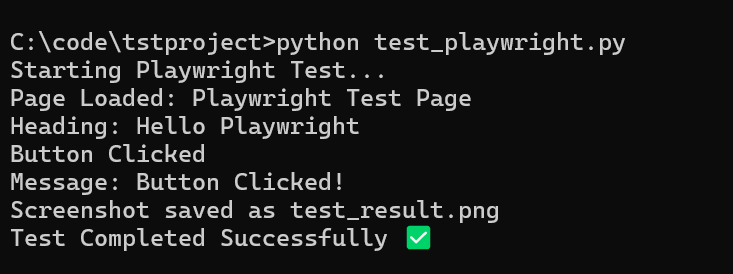
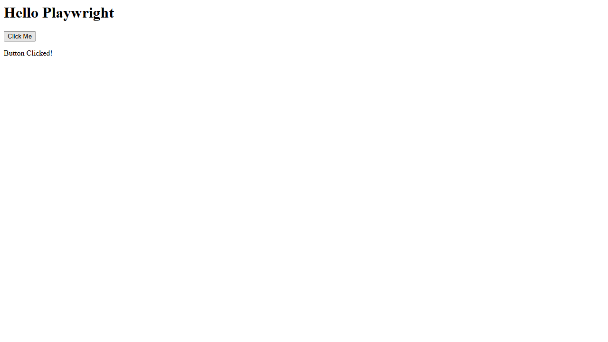

# Playwright Integration PoC for Django Testing

## Objective

The goal of this Proof of Concept (PoC) is to explore replacing Selenium-based integration tests in Django with Playwright, focusing on simplicity, reliability, and maintainability.

---

## What I Implemented

- Created a simple Django application with a testable UI
- Integrated Playwright for browser-based testing
- Implemented a test that:
  - Loads the Django page
  - Verifies UI elements
  - Performs user interaction (button click)
  - Validates dynamic content updates
  - Captures screenshots for debugging

---

## Code Overview

The Playwright test performs the following steps:

1. Launches a Chromium browser
2. Opens a new page and navigates to the Django server
3. Locates elements using selectors (#heading, #btn)
4. Verifies initial content
5. Clicks a button
6. Checks updated text
7. Takes a screenshot

---
## Observations

- Playwright provides a cleaner and more intuitive API compared to Selenium
- Element selection and interaction are more straightforward
- Handling dynamic content is more reliable with built-in waiting mechanisms
- Reduced boilerplate code improves developer productivity

---

## Challenges

- Integrating Playwright with Django’s existing test runner architecture
- Understanding and managing sync vs async execution in Playwright
- Ensuring compatibility with Django’s testing infrastructure and workflows

---

## Future Work

- Convert existing Django Selenium tests to Playwright
- Design a reusable PlaywrightTestCase similar to Django’s Selenium test classes
- Explore CI/CD integration for Playwright-based tests
- Plan and validate a complete migration strategy within a single release cycle

---

## How to Run

1. Start the Django development server:
   python manage.py runserver

2. Run the Playwright test:
   python test_playwright.py

---

## Conclusion

This PoC demonstrates that Playwright can effectively replace Selenium for Django integration testing, offering improved reliability, reduced complexity, and a better developer experience.

## Key Code Snippet

```python
page.goto("http://127.0.0.1:8000")
page.click("#btn")
assert page.locator("#message").inner_text() == "Button Clicked!"
```


## Output Screenshots

### Terminal Output



### Browser Interaction


